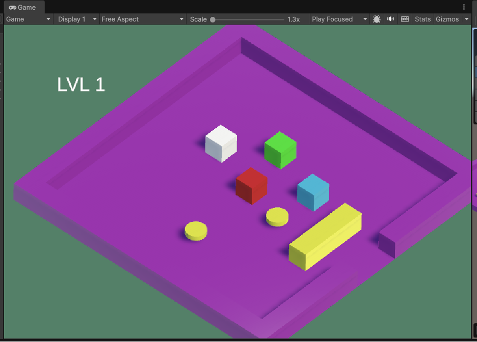

# Основное задание
1.	Выберите язык программирования (который Вы ранее не изучали) и (1) напишите по нему реферат с примерами кода или (2) реализуйте на нем небольшой проект (с детальным текстовым описанием).
2.	Реферат (проект) может быть посвящен отдельному аспекту (аспектам) языка или содержать решение какой-либо задачи на этом языке.
3.	Необходимо установить на свой компьютер компилятор (интерпретатор, транспилятор) этого языка и произвольную среду разработки.
4.	В случае написания реферата необходимо разработать и откомпилировать примеры кода (или модифицировать стандартные примеры).
5.	В случае создания проекта необходимо детально комментировать код.
6.	При написании реферата (создании проекта) необходимо изучить и корректно использовать особенности парадигмы языка и основных конструкций данного языка.
7.	Приветствуется написание черновика статьи по результатам выполнения ДЗ. Черновик статьи может быть подготовлен группой студентов, которые исследовали один и тот же аспект в нескольких языках или решили одинаковую задачу на нескольких языках.

# Разработка игры на Unity

