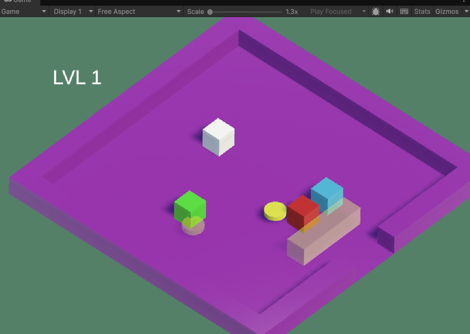
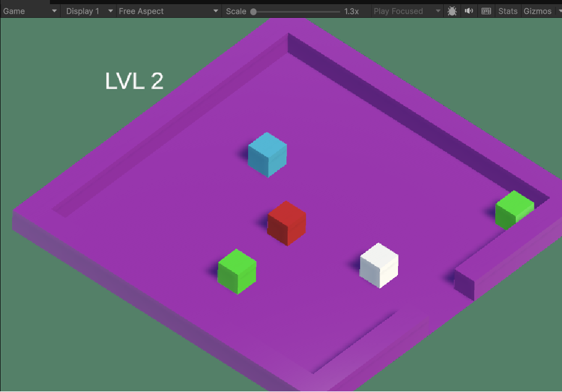
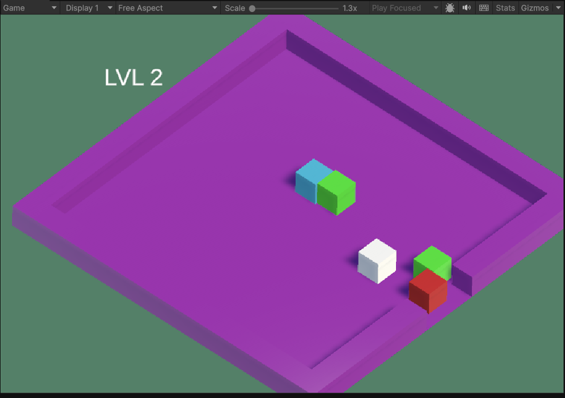
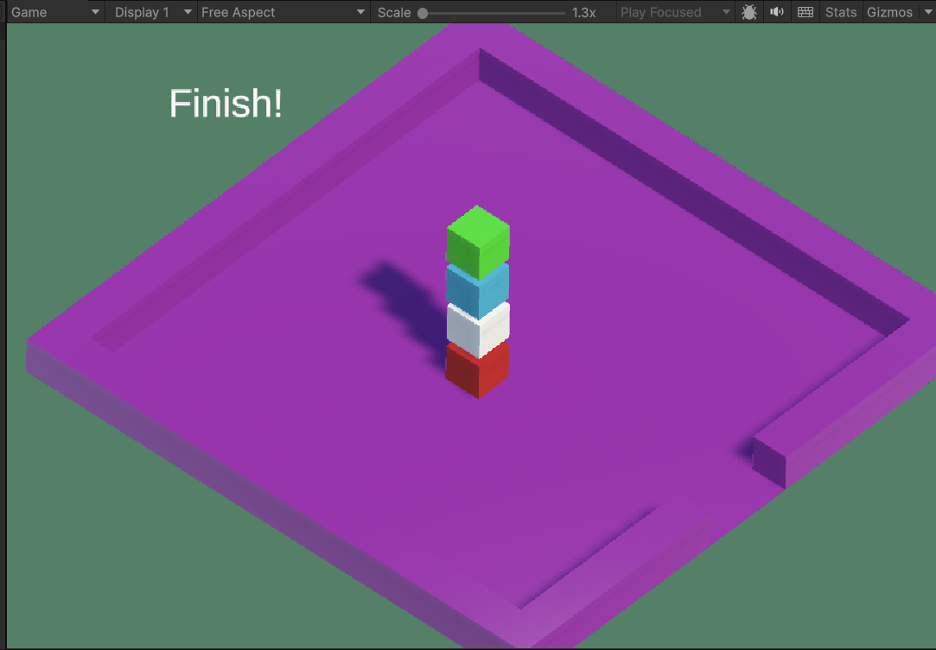

# Основное задание

1.	Выберите язык программирования (который Вы ранее не изучали) и (1) напишите по нему реферат с примерами кода или (2) реализуйте на нем небольшой проект (с детальным текстовым описанием).
2.	Реферат (проект) может быть посвящен отдельному аспекту (аспектам) языка или содержать решение какой-либо задачи на этом языке.
3.	Необходимо установить на свой компьютер компилятор (интерпретатор, транспилятор) этого языка и произвольную среду разработки.
4.	В случае написания реферата необходимо разработать и откомпилировать примеры кода (или модифицировать стандартные примеры).
5.	В случае создания проекта необходимо детально комментировать код.
6.	При написании реферата (создании проекта) необходимо изучить и корректно использовать особенности парадигмы языка и основных конструкций данного языка.
7.	Приветствуется написание черновика статьи по результатам выполнения ДЗ. Черновик статьи может быть подготовлен группой студентов, которые исследовали один и тот же аспект в нескольких языках или решили одинаковую задачу на нескольких языках.

# Разработка игры на Unity

Данный работа представляет собой выполненное домашнее задание по дисциплине «Парадигмы и конструкции языков программирования» студенток группы ИУ5-33Б Якубовой Д. Р. и Алиевой Э. Р.

В рамках задания выбран вариант реализации практического проекта — разработки небольшой игры на платформе Unity с использованием языка программирования C#.

## Основные характеристики работы:

1. **Использование нового инструментария**: в ходе работы была установлена и применена среда разработки Unity, а также изучен язык C# в контексте игровой логики.
2. **Структура проекта**: проект включает два основных скрипта:
   - `Activator.cs` — управляет взаимодействием объектов, изменяет их физические свойства и материалы.
   - `Player.cs` — реализует управление персонажем, обработку ввода, перемещение и переход между сценами.
3. **Демонстрация работы**: приведены скриншоты игрового процесса, подтверждающие работоспособность и визуальную реализацию проекта.
4. **Соответствие требованиям**: код написан с учётом парадигмы объектно-ориентированного программирования, использованы основные конструкции C#, обеспечена компиляция и запуск проекта.

### Работа является законченным учебным проектом, демонстрирующим умение применять новые языки и среды разработки для создания интерактивных приложений. Проект соответствует поставленным задачам и может служить основой для дальнейшего изучения игровых технологий и языков программирования.

